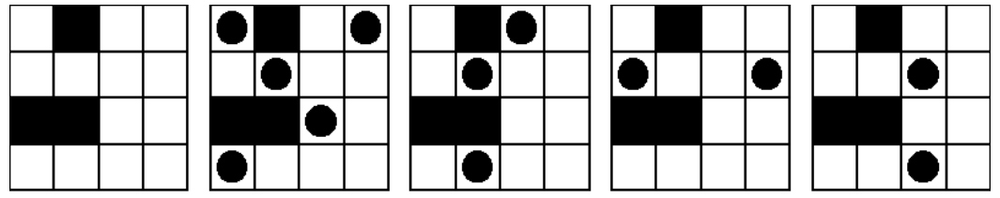

# 639 – Colocando Torres de Xadrez
[639 – Colocando Torres de Xadrez]()

No xadrez, uma torre é uma peça que pode se mover quantas casas quiser verticalmente e horizontalmente.
Neste problema, serão utilizados pequenos tabuleiros de xadrez [de tamanho máximo 4x4] que podem conter muros através dos quais uma torre não pode se mover.
O objetivo é colocar a maior quantidade possível de torres nestes tabuleiros de forma que duas torres não possam capturar uma a outra.
Uma configuração de torres é legal sempre que duas torres não estejam na mesma linha horizontal ou coluna vertical, a não ser que haja ao menos um muro separando as duas (neste caso, isso será legal).

A seguinte imagem mostra cinco figuras de um mesmo tabuleiro. 
A primeira corresponde a um tabuleiro vazio (note que este tabuleiro possui três muros).
A segunda e a terceira figuras mostram configurações legais, e a quarta e a quinta mostram configurações ilegais. Para este
tabuleiro, o número máximo de torres é 5; a segunda figura desta imagem mostra uma das configurações legais com 5 torres (mas há outras configurações possíveis com 5 torres).



Sua tarefa é escrever um programa que, para cada descrição de tabuleiro, calcule o número máximo de torres que podem ser colocadas nele em uma configuração legal.

## A Entrada
A entrada conterá uma ou mais descrições de tabuleiros, seguidas por uma linha contendo o número 0 significando o fim da entrada.
Cada descrição de tabuleiro começa com um linha contendo um inteiro positivo n que é o tamanho do tabuleiro (tabuleiros sempre serão quadrados e n valerá, no máximo, 4).
Cada uma das próximas n linhas descrevem uma linha do tabuleiro, onde um '.' (ponto) indicará uma casa vazia e um 'X' (em letra maiúscula) indicará uma parede.
Não há espaços em branco na entrada.

## A Saída
Para cada caso de teste, imprima uma linha contendo o número máximo de torres que podem ser colocadas em uma configuração legal.

## Exemplo de Entrada
```
4
.X..
....
XX..
....
2
XX
.X
3
.X.
X.X
.X.
3
...
.XX
.XX
4
....
....
....
....
0
```

## Exemplo de Saída
```
5
1
5
2
4
```

## Apêndice
### Original 
Esse problema faz parte do banco de problemas da Universidade de Valladolid (UVa) e pode ser encontrado em []().

Outros desafios pode ser encontrados em [https://uva.onlinejudge.org/index.php?option=com_onlinejudge&Itemid=8&category=1](https://uva.onlinejudge.org/index.php?option=com_onlinejudge&Itemid=8&category=1).

### Tradução
Esse texto foi traduzido pelo Prof. Dr. Luciano Antonio Digiampietri da Universidade de São Paulo (USP) para uso na disciplina de Desafios de programação I (ACH2107) oferecida pela Escola de Artes Ciências e Humanidades (EACH).

Mais informações em [each.uspnet.usp.br/digiampietri](http://each.uspnet.usp.br/digiampietri/).

